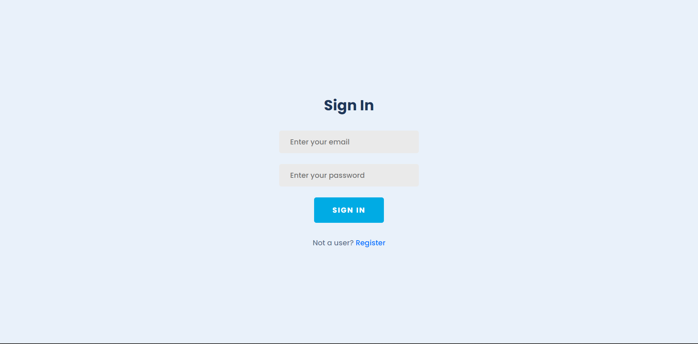
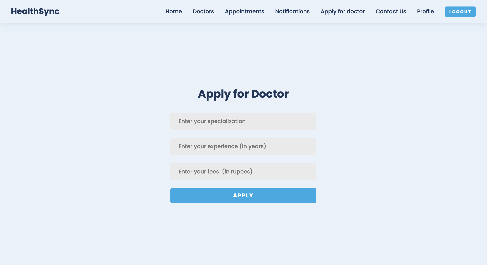

<h1 align="center">HealthSync 🧑‍⚕️</h1>

<h3>📝 Description :</h3> 
Welcome to our comprehensive healthcare platform! Our website offers a seamless experience for users and doctors alike. Sign up or log in to unlock a range of features. Easily browse through a list of available doctors, manage your profile, and submit queries effortlessly. Stay updated with notifications and enjoy secure access to your information. Aspiring doctors can apply through our user-friendly system. Book appointments with your preferred doctors and track their completion status. Admin features ensure smooth operations, including approval of doctor applications and user management. Rest assured, all data is stored securely. Join us to experience a new era of convenient and efficient healthcare interactions.

 

 

### 🛠️ Tools and technologies used :

 

### 👋 Connect with me:

 

---

<a href="#top">Back to Top</a>

### 📃Features :

<ul>
  <li><strong>User Registration and Login:</strong> Enabling user registration and login functionality is the foundation of any user-oriented platform.</li>
  <li><strong>View Available Doctors:</strong> Allowing users to easily view the list of available doctors helps them find the right medical professional for their needs.</li>
  <li><strong>Update Profile:</strong> Providing users with the ability to update their profiles keeps their information accurate and up to date.</li>
  <li><strong>Contact Section for Queries:</strong> Including a contact section for user queries enhances user engagement and customer support.</li>
  <li><strong>Notifications Tab:</strong> A notifications tab helps users stay informed about updates, appointments, and application statuses.</li>
  <li><strong>Admin Management System:</strong> An admin management system is crucial for overseeing users, appointments, and doctor applications.</li>
  <li><strong>Access Control:</strong> Restricting access to certain sections like notifications, profile, appointments, and doctor applications to logged-in users ensures data privacy and security.</li>
  <li><strong>Doctor Application:</strong> Allowing users to apply to become a doctor on the site expands the pool of medical professionals and adds value to the platform.</li>
  <li><strong>Book Appointments:</strong> Enabling users to book appointments with their preferred doctors streamlines the process of accessing medical services.</li>
  <li><strong>Admin Approval for Doctor Requests:</strong> Admin approval for doctor applications ensures that only qualified professionals are listed on the platform.</li>
  <li><strong>User and Doctor Removal:</strong> Admin's ability to remove users or doctors from the site is crucial for maintaining the platform's integrity.</li>
  <li><strong>Appointment Marking:</strong> Allowing doctors and admin to mark appointments as completed ensures proper record-keeping.</li>
  <li><strong>Application and Appointment Notifications:</strong> Sending notifications to users, doctors, and admins about application statuses and appointment updates enhances communication.</li>
  <li><strong>Data Storage and Security:</strong> Storing all data in a database ensures data integrity, security, and easy retrieval of information.</li>
</ul>

<a href="#top">Back to Top</a>

### Home page

### Sign up page

### Sign in page

### Profile page

### All Doctors page

### Apply for doctor page

### Admin all users dashboard

### Admin all applications page

### Book Appointment page

### Users all appointments page

### Doctors all appointments page

### Notifications page

---

 

<a href="#top">Back to Top</a>
